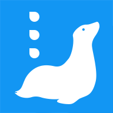

# Blue Log



## Concept

Mobile application to log everything and anything in really simple steps.

Help you log your life, what you eat, what you buy, or any others event. Collect data to be able to do analysis.


## Install

The application is built using react native

Run
```
npm i
npm start
```

### Database

```bash
npx prisma migrate prod --name init
npx prisma generate # to generate the Prisma Client. You can then start querying your database.
```


## Contributing


#### Projects snippets for vs code
To use them install the [Project Snippets](https://marketplace.visualstudio.com/items?itemName=rebornix.project-snippets) extension

#### Code standards extensions
 - [Eslint](https://marketplace.visualstudio.com/items?itemName=dbaeumer.vscode-eslint)
 - [EditorConfig](https://marketplace.visualstudio.com/items?itemName=EditorConfig.EditorConfig)

#### Git config
Make sure file are commited as lf line endings
> git config --global core.autocrlf false

See [explanation](https://stackoverflow.com/questions/1249932/git-1-6-4-beta-on-windows-msysgit-unix-or-dos-line-termination/1250133#1250133) for the choice


#### Building the default products database

```
pip install csvs-to-sqlite
csvs-to-sqlite products.csv products.db
```
